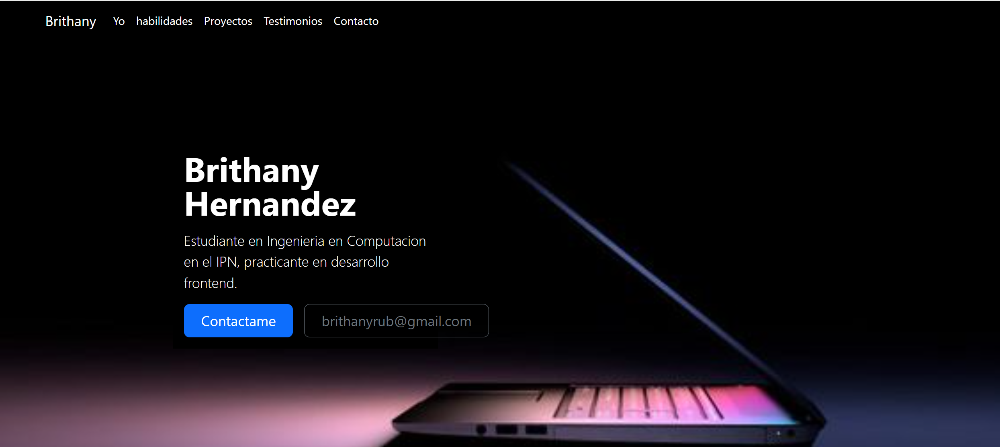
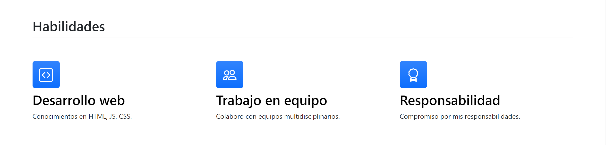
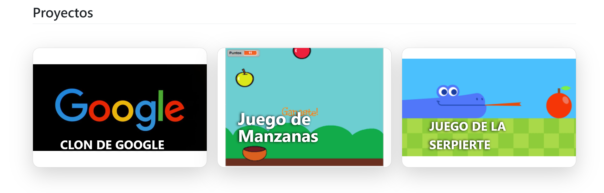
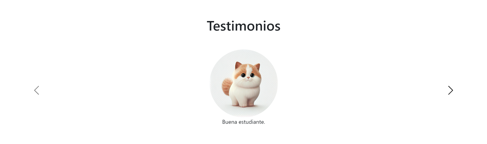

# Mi protafolio de habilidades

El presente proyecto es un portafolio desarrollado para poner en práctica
las habilidades obtenidas dentro del bootcamp de desarrollo frontend 

Fue desarrollado con HTML, CSS y JS con el uso de el framework de UI, Bootstrap
utilizando además bibliotecas externas.

La página es responsiva (adaptable a diferentes tamaños de pantalla) e incluye
presentacion de la autora del proyecto.

Proyecto desplegado. https://brithanyhernandez.netlify.app/

## secciones de mi sitio

## Tecnologías
   * HTML
   * CSS
   * Bootstrap
   * Javascript

   ---
   * Desarrollado por [Brithany Hernandez](https://github.com/BrithanyHernandez) en [Tecnolochicas](https://tecnolochicas.mx/)